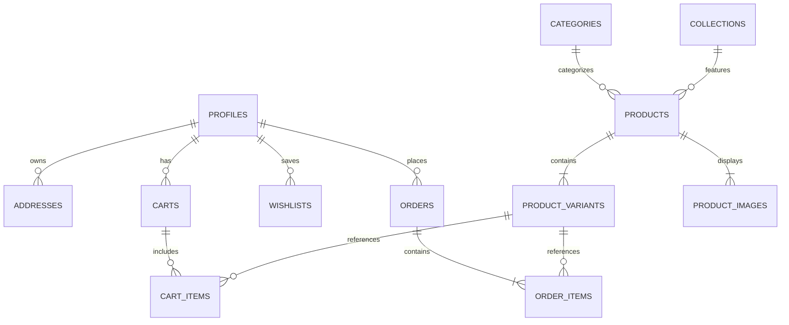

# ay2fly — Architectural Streetwear Atelier


> **Portfolio-Grade Full-Stack E-Commerce Platform**  
> Engineered with Next.js 16 (App Router), Supabase PostgreSQL, Row Level Security (RLS), Server-Enforced RBAC, and Framer Motion micro-interactions.

---

## 🏛️ Brand & Concept

**ay2fly** is a high-concept Gen-Z architectural streetwear label blending brutalist silhouettes, industrial materials, and precision tailoring. Designed and engineered as a production-grade DTC fashion platform, it prioritizes uncompromising design aesthetics, live database persistence, and airtight backend security.

---

## ⚡ Tech Stack & Architecture

- **Frontend & Routing:** [Next.js 16](https://nextjs.org/) (App Router, Turbopack, Server & Client Components)
- **Database:** [PostgreSQL on Supabase](https://supabase.com/) with native connection pooling
- **Security & Authorization:** 
  - PostgreSQL **Row Level Security (RLS)** across all 14 tables
  - Security Definer trigger (`protect_profile_role`) prohibiting non-admin role escalation
  - Server-side role verifier (`verifyAdmin`) protecting admin mutations
- **Authentication:** Supabase Auth (Email/Password, Google OAuth, Session Management)
- **State Management:** Zustand stores with real-time PostgreSQL synchronization for Cart and Wishlist
- **Styling & Motion:** Tailwind CSS, Glassmorphic Brutalism design system, Framer Motion animations
- **Icons & UI:** Lucide React

---

## 🗄️ Database Schema & Security

The database consists of 14 normalized PostgreSQL tables:



1. **`profiles`**: User metadata, synchronized from `auth.users` via trigger, protected against client role tampering.
2. **`categories`** & **`collections`**: Dynamic taxonomy and seasonal drops.
3. **`products`**, **`product_variants`**, **`product_images`**: Multi-variant SKU tracking, inventory counts, and multi-angle product photography.
4. **`size_guides`**: Garment-specific physical dimensions (chest, waist, hip, garment length).
5. **`carts`** & **`cart_items`**: Persistent user carts with live DB upsert and RLS isolation.
6. **`wishlists`**: User-scoped favorited garments.
7. **`orders`** & **`order_items`**: Real order placement with stock revalidation, decrementing variant stock upon checkout.
8. **`addresses`**: User shipping address book.
9. **`newsletter_subscribers`**: Marketing audience capture.

---

## 🚀 Getting Started

### Prerequisites

- Node.js 18.17+ or Node.js 20+
- A Supabase account and project

### Installation

1. Clone the repository:
   ```bash
   git clone https://github.com/victorayo234/ay2fly.git
   cd ay2fly
   ```

2. Install dependencies:
   ```bash
   npm install
   ```

3. Configure environment variables:
   Copy `.env.example` to `.env.local` and provide your Supabase credentials:
   ```bash
   cp .env.example .env.local
   ```

4. Run database migrations & catalog seeding:
   ```bash
   node --env-file=.env.local scripts/setup-database.js
   ```

5. Launch development server:
   ```bash
   npm run dev
   ```

Open [http://localhost:3000](http://localhost:3000) in your browser.

---

## 🔒 Security & Verification Highlights

- **Row Level Security (RLS):** All user tables enforce `USING (auth.uid() = user_id)`. Cross-user data snooping is rejected at the PostgreSQL engine level (`code: 42501`).
- **Server-Side Admin Validation:** Admin actions (`/api/products`, `/api/orders`) verify caller permissions directly in PostgreSQL before executing.
- **Cross-Session Real Persistence:** Carts, wishlists, and orders survive browser restarts, private/incognito sessions, and device switches.

---

## 📄 License

MIT © [victorayo234](https://github.com/victorayo234)
